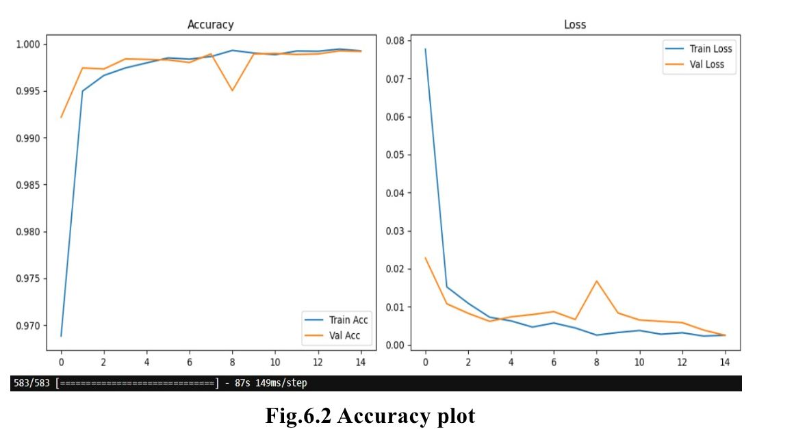
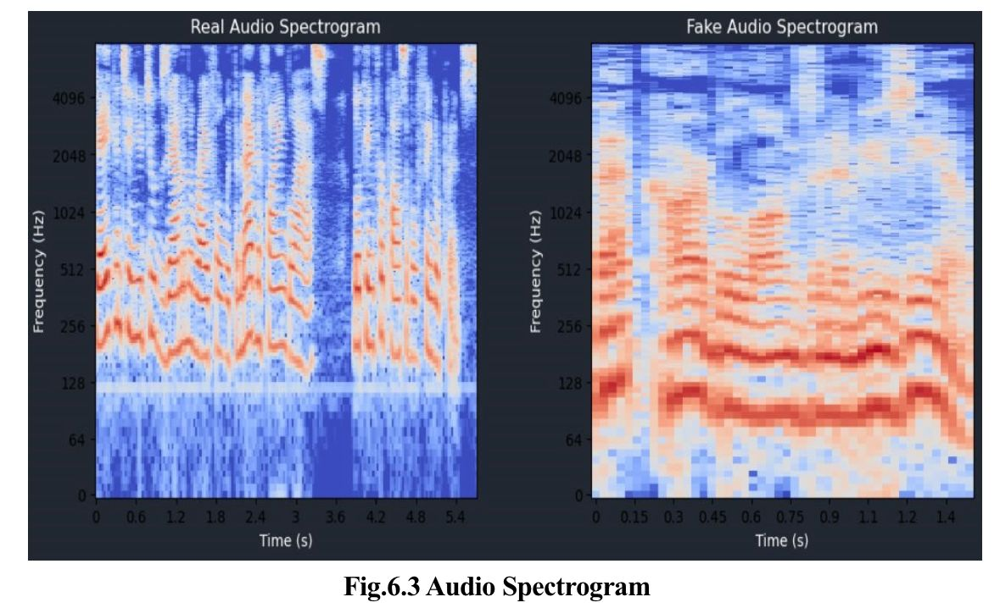
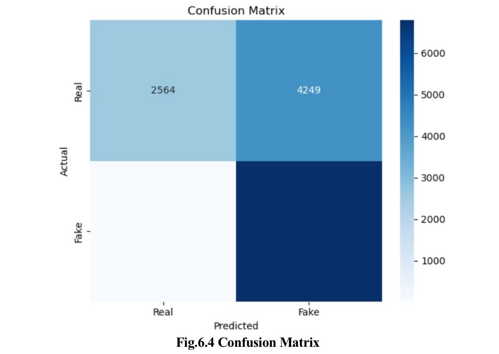

# 🎙 AI-Morphed Voice Detection System

This project detects whether a voice is real or AI-generated (deepfake) using RGB spectrograms and a CNN-LSTM hybrid deep learning model. The model learns spatial and temporal features from spectrogram images of audio clips to classify them accurately.


## 📌 Project Objective

To classify voice samples into Real or Fake by:
- Converting audio to RGB spectrograms
- Feeding spectrograms into a CNN-LSTM model
- Predicting class based on learned patterns


## 🧠 Model Architecture

A hybrid architecture combining:
- CNN layers: for spatial feature extraction from spectrogram images
- LSTM layer: to model temporal sequences over image slices
- Dense layers: for final classification


## 🛠 Technologies Used

- Python
- OpenCV (cv2)
- TensorFlow / Keras
- NumPy
- Scikit-learn
- Librosa (for audio to spectrogram conversion)
- Matplotlib


## 🗂 Project Structure

📁 dataset/
├── training/
│   ├── real/
│   └── fake/
├── validation/
│   ├── real/
│   └── fake/
└── testing/
├── real/
└── fake/

📄 Voice_pro.py          # Main training and evaluation script
📄 README.md             # Project overview and instructions
📄 best_model.h5         # Best saved model after training
📄 requirements.txt      # Required Python packages


## 🚀 How to Run

### 🔧 1. Install Dependencies

```bash
pip install -r requirements.txt

python Voice_pro.py

## 📊 Model Performance

### ✅ Accuracy Over Epochs


### 🎧 Sample Audio Spectrogram (RGB)
This is an example of how audio is converted into RGB spectrograms:


### 🧠 Confusion Matrix (Test Results)
Shows model performance on test data:


## 📘 Jupyter Notebook Demo

👉 [VoiceDetection_Demo.ipynb](VoiceDetection_Demo.ipynb)  
This notebook contains all model steps, training, and evaluation.
